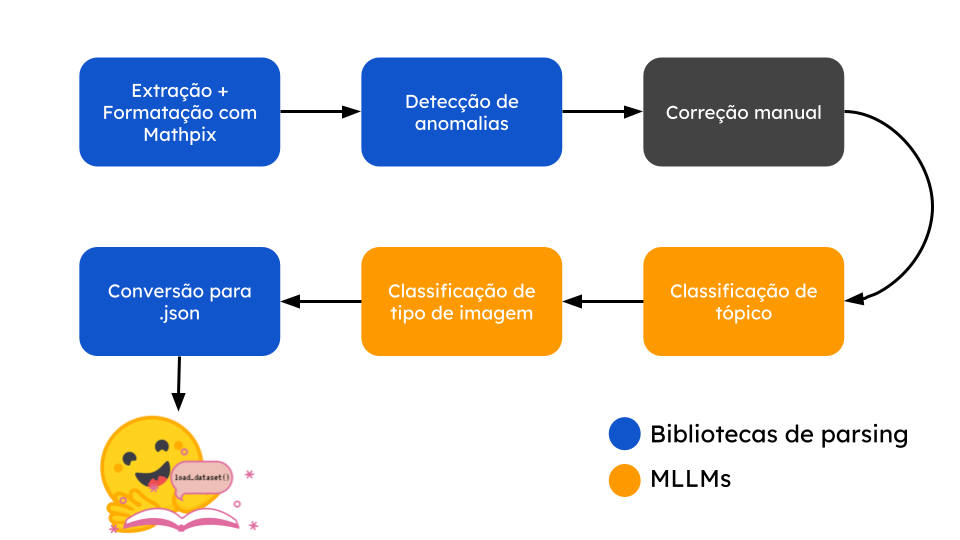

# Projeto BEMU

Nesse repositório disponibilizamos o código utilizado no projeto BEMU (Benchmarks Educacionais Multimodais Universiárias) realizado pelo RAIA como parte de uma colaboração de um projeto maior, a ser anunciado em breve. O projeto teve como objetivo realizar uma coleta de dados para a criação de uma nova benchmark multimodal (i.e. que contempla mais de uma modalidade de entrada; consideramos as modalidades de texto e imagem) com perguntas de vestibulares brasileiros, os quais não só possuem dados nativos em PT-br como também são ricos em conhecimentos específicos relacionados a cultura brasileira. Para mais detalhes sobre o projeto recomendamos uma leitura do nosso [artigo no Medium](https://medium.com/@raia.diretoria/indo-al%C3%A9m-do-ingl%C3%AAs-ampliando-o-horizonte-de-avalia%C3%A7%C3%B5es-de-ias-multimodais-a5249af02f7a).

O código disponibilizado pode ser utilizado para a a extração de dados de PDFs usando uma estratégia híbrida, ou seja, que se utiliza tanto de bibliotecas de parsing quanto MLLMs (e.g. Gemini 1.5) para coletar os dados desejados como ilustrado no diagrama abaixo. O resulado final é um dataset único em .json com enunciado, alternativas, imagens e metadados para cada uma questão das provas passadas.

<p align="center">

<p align="center">
<em>Pipeline de extração de dados utilizada.</em>
</p> 
</p> 

O código providenciado pode ser usado para extrair dados e formatar provas de múltipla escolha no geral, porém devido a pequenas variações entre provas em termos de estrutura notamos que algumas funções providenciadas estão sujeitas a mudanças para o funcionamento ideal do código. Contudo, acreditamos que ele possa servir como uma template sólido para a realização desse tipo de tarefa.

## 🤗 Datasets

O projeto foi realizado como uma colaboração em um projeto de maior escala. Dessa forma, vamos adiar o lançamento dos dados até o início de Março para que todos os detalhes sejam lançados de maneira síncrona.

## 📚 Entrada esperada
Devido a dificuldade de conversão manual de expressões matemáticas e de fórmulas químicas de maneira padronizada utilizamos o Mathpix para extrair os dados presentes nos PDFs das provas e convertê-los para LaTeX, além de fazer a extração de imagens presentes nos documentos. O uso dessa plataforma não é necessária (porém altamente recomendado dados os [desafios encontrados durante a extração](https://medium.com/@raia.diretoria/indo-al%C3%A9m-do-ingl%C3%AAs-ampliando-o-horizonte-de-avalia%C3%A7%C3%B5es-de-ias-multimodais-a5249af02f7a))), porém o script de extração de dados espera uma estrutura de diretórios e arquivos como ilustrada abaixo para seu funcionamento, com uma pasta para cada ano e dentro dela um arquivo .tex com os conteúdos das provas e outro com os dados do gabarito.

```
.
└── UNESP
    ├── 2014
    │   ├── images
    │   ├── prova.tex
    │   └── gabarito.tex
    ├── 2015
    ├── 2016
    ├── 2017
    ...
    └── 2025
```
## 📑 Formato do dataset

Como observado acima, o script resulta na criação de um dataset único por prova armazenado em um .json. Cada elemento do arquivo representa uma questão, a qual possui as seguinte informações:
```Python
    questao = {
        'language': 'pt', #Idioma da questão.
        'country': 'Brazil', # País de origem da questão.
        'file_name': '', # Nome do arquivo onde a questão está armazenada.
        'source' : '', # Fonte da questão.
        'license': 'Unknown', # Licença da questão.
        'level' : 'University Entrance', # Nível de dificuldade da questão.
        'category_en' : '', # Categoria da questão em inglês.
        'category_original_lang' : '', # Categoria da questão no idioma original.
        'original_question_num' : -1, # Número original da questão.
        'question' : '', # Enunciado.
        'options' : [], # Alternativas.
        'answer' : '', # Resposta correta (index de 0 a 3 de acordo com o valor em "options").
        'image_png' : '', # Caminho para a imagem associada à questão.
        'image_information' : None, # Se a imagem é essencial ou não para o entendimento da questão.
        'image_type' : None, # Tipo de imagem (e.g. diagrama, tabela).
        'parallel_question_id' : None # ID de uma questão paralela, se houver.
    }
```

Abaixo mostramos um exemplo de uma questão depois de processada:
```Python
{
    "language": "pt", 
    "country": "Brazil", 
    "file_name": "UNESP2014_1fase_prova", 
    "source": "https://www.curso-objetivo.br/vestibular/resolucao-comentada/unesp/2014/1fase/UNESP2014_1fase_prova.pdf", 
    "license": "Unknown", 
    "level": "University Entrance", 
    "category_en": "English", 
    "category_original_lang": "Inglês", 
    "original_question_num": 21, 
    "question": "Examine o quadrinho.\n\n\nO homem responde que a empresa", 
    "options": ["utiliza práticas de conservação ambiental e de reciclagem de papel.", 
        "tem uma publicação que pretende parecer ambientalmente correta.", 
        "trabalha somente com matérias-primas naturais de fontes renováveis.", 
        "esclarece todas as dúvidas sobre o meio ambiente em seu livreto."], 
    "answer": 1, 
    "image_png": "unesp_2014_21_2025_01_24_7db1472f3078959911e1g-07.png", 
    "image_information": "essential", 
    "image_type": "text", 
    "parallel_question_id": null}
```

<details>
  <summary> Observações acerca do formato </summary>

Para garantir a qualidade dos dados mantivemos algumas etapas de correção manual. Para esses casos, escrevemos algumas funções responsáveis por detectar anomalias comuns resultantes de erros de parsing (e.g. questão sem título, mais de uma imagem em uma mesma questão). Notamos também que algumas verificações não são estritamente necessárias, como limitar uma imagem apenas por enunciado, mas foram tomadas para padronizar os datasets e torná-los mais fáceis de serem utilizados para fins avaliativos.

</details>


## 🛠️ Como executar o código

Primeiro devemos criar um environment usando [Anaconda](https://www.anaconda.com/) onde todas as dependências serão baixadas (optamos pelo uso de Anaconda mas o mesmo pode ser feito usando outras ferramentas como venv ou uv):
```Bash
conda create -n "bemu" python=3.10.14 ipython
conda activate bemu
```

Em seguida, o projeto é clonado e baixamos as dependências necessárias para a execução do código :
```Bash
git clone https://github.com/gruporaia/BEMU.git
cd BEMU
pip install -r requirements.txt
```

Antes de executar o código, altere informações da variável global `SOURCE_DICT` e das funções `translate_subject()` e `prompt_gemini_subject()` para que ela se adeque ao seu contexto das suas provas. Além disso, como utilizamos o Gemini 1.5 como ferramenta para auxiliar a coleta de alguns metadados relacionados a imagens é necessário que uma chave de API seja [criada](https://ai.google.dev/gemini-api/docs/api-key) e designada a uma variável global no seu ambiente executando o comando:
```Bash
export GEMINI_API_KEY=<SUA_CHAVE>
```

Finalmente, o código de extração pode ser usado rodando o seguinte comando:
```Bash
python process_data.py --prova_dir <DIRETORIO_DAS_PROVAS>
```

Depois da passagem por todas as etapas de pipeline de processamento os dados serão armazenados em um arquivo único em `<DIRETORIO_DAS_PROVAS>/data.json` e todas as mídias estarão disponíveis em `<DIRETORIO_DAS_PROVAS>/images/`.

## 💻 Quem somos nós?
|  |  Este projeto foi desenvolvido pelos membros do **RAIA (Rede de Avanço de Inteligência Artificial)**, uma iniciativa estudantil do Instituto de Ciências Matemáticas e de Computação (ICMC) da USP - São Carlos. Somos estudantes que compartilham o objetivo de criar soluções inovadoras utilizando inteligência artificial para impactar positivamente a sociedade. Para saber mais, acesse [nosso site](https://gruporaia.vercel.app/) ou [nosso Instagram](instagram.com/grupo.raia)! |
|------------------|-------------------------------------------|
 
### **Desenvolvedores**
- **André Mitri** - [LinkedIn](https://www.linkedin.com/in/andre-de-mitri/) | [GitHub](https://github.com/andregdmitri)
- **Leticia Marchezi** - [LinkedIn](https://www.linkedin.com/in/letmarchezi/) | [GitHub](https://github.com/letMarchezi/)
- **Gabriel Merlin** - [LinkedIn](https://www.linkedin.com/in/gabrielcmerlin/) | [GitHub](https://github.com/gabrielcmerlin)
- **Otávio F. Coletti** - [LinkedIn](https://www.linkedin.com/in/ot%C3%A1viocoletti-012/) | [GitHub](https://github.com/otaviofcolett)
- **Luísa Shimabucoro** - [LinkedIn](https://www.linkedin.com/in/lushimabucoro) | [Website](http://luisashimabucoro.github.io)
